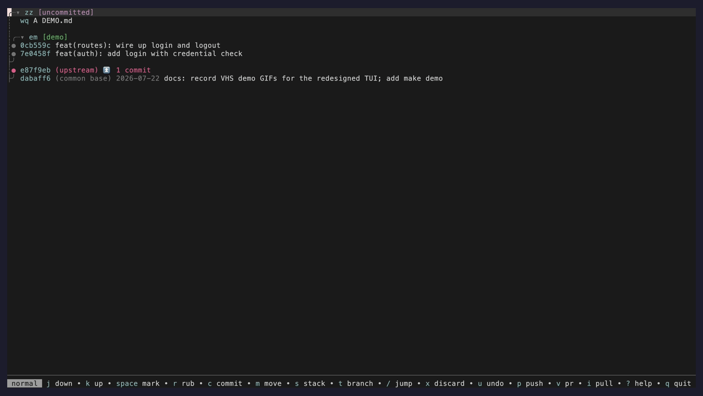
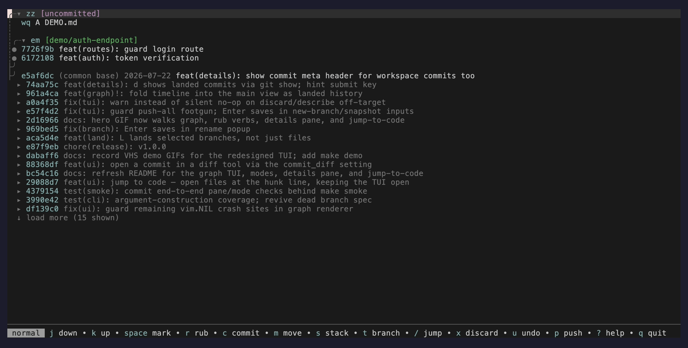
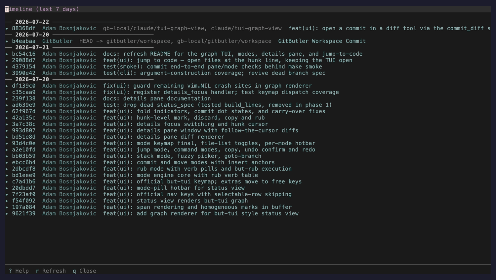

# gitbutler.nvim

A Neovim interface for [Git Butler](https://gitbutler.com) virtual branches, modelled on the official `but tui`. A scrollable commit graph is the workspace: navigate branches and commits, assign and commit changes through modal rub / commit / move / stack operations, inspect diffs in a details pane, and jump straight from a hunk into the file to edit it — all without leaving your editor. Push, open pull requests, land, and inspect CI from the same buffer.

Requires neovim 0.10+ and the [`but` CLI](https://docs.gitbutler.com/cli-overview). The CI view also uses the [`gh` CLI](https://cli.github.com) when available; everything else has zero runtime dependencies.

One flow through the workspace: navigate the commit graph, rub a change onto a target (the pill names the verb), inspect the diff in the details pane, and jump straight into the file to edit it:



Modal operations mirror `but rub`: pick a source, move to a target, and the pill names the verb (`assign`, `amend`, `squash`, `move`…) before you confirm:



Timeline (`T`) — a bird's-eye view of recent work across every branch and contributor:




## Installation

Install the `but` CLI first:

```sh
brew install gitbutler
```

Then initialise Git Butler in your repository:

```sh
cd your-repo
but setup
```

### Optional: deep CI surfacing

The CI view (`:ButlerCI`, `C` in `:Butler`) shells out to the GitHub CLI. Install with:

```sh
brew install gh
gh auth login
```

Without `gh`, the CI features are no-ops (`v`/PR creation still works through `but pr`).

### lazy.nvim

```lua
{
  'abosnjakovic/gitbutler.nvim',
  config = function()
    require('gitbutler').setup()
  end,
}
```

### vim.pack (native packages)

```lua
vim.pack.add { 'https://github.com/abosnjakovic/gitbutler.nvim' }
require('gitbutler').setup()
```

### Local development

```lua
vim.opt.rtp:prepend(vim.fn.expand('~/path/to/gitbutler.nvim'))
require('gitbutler').setup()
```

### Pin to a release tag

Releases follow [Conventional Commits](https://www.conventionalcommits.org/) and are cut by [release-please](https://github.com/googleapis/release-please) when a release PR is merged. To pin to a stable version:

```lua
{ 'abosnjakovic/gitbutler.nvim', tag = 'v0.1.4' }
```

See the [releases page](https://github.com/abosnjakovic/gitbutler.nvim/releases) for the changelog.

## Usage

Open the status buffer with `:Butler` or bind it to a key:

```lua
vim.keymap.set('n', '<leader>bb', ':Butler<CR>', { desc = 'gitbutler' })
```

The status view mirrors the graph layout and modal interaction of the official `but tui`: rub, commit, move, and stack modes replace the old direct-action keys. If you used the previous keymap, note: `s` (assign) and `S` (squash) are now rub-mode operations (`r`, then pick a target — squash is rub commit onto commit), `m` enters move mode, `U` is redo (uncommit is a rub verb), `d` moved to `<CR>` (describe/reword), and committed-file lists are hidden by default — press `f` (one commit) or `F` (all). New keys: `t` go to branch, `/` jump to id, `:`/`!` command modes, `y` copy, `n` empty commit, `M` editor reword, `<Esc>` back, and `d`/`D`/`+`/`-`/`l` for the details pane (see below) — note `d` is the pane toggle now, not describe. `g`/`G` are bound in the view, so `gg`/`gt` don't work inside it; all keys are remappable via `setup` keymaps.

### Commands

`:Butler` toggles the status view. `:ButlerBranches` opens the branch management popup. `:ButlerLog [branch]` shows the commit log for a branch (defaults to the first applied branch). `:ButlerTimeline` shows a chronological view of recent commits across all branches and contributors. `:ButlerOplog` opens the operations history. `:ButlerAbsorb`, `:ButlerPush`, `:ButlerPull`, and `:ButlerUndo` run the corresponding operations directly. `:ButlerCI [branch]` opens the CI view for a branch. `:ButlerAutoMerge <branch>` toggles auto-merge on the PR for that branch.

### Multi-select

Press `<Space>` on any file or commit line to toggle its selection. Selected items are highlighted and marked with `✔︎`. Once you have a selection, the next action you trigger applies to all selected items rather than just the cursor line. Selection is homogeneous — files and commits can't be mixed in the same selection; selecting a line of the other category is rejected. Selection clears automatically after an action completes but persists across refreshes.

Actions that support multi-select: rub (`r` — the whole selection becomes the mode's source), move (`m`), discard (`x`), and open file (`o`). Rub sources run one CLI call per item against the chosen target; move passes all sources in a single `but move` call. Selecting items across different branches is allowed — the CLI determines validity per item.

### Status buffer keybindings

Navigation:

```
j/k      Next / previous row
<Down>/<Up>  Next / previous row
J/K      Next / previous section
<C-d>/<C-u>  Jump 10 rows
g/G      Uncommitted area / merge base
t        Go to branch (fuzzy picker)
/        Jump to a CLI id (exact or unique prefix)
<Esc>    Back: exit the active mode, else clear marks
```

Marks:

```
<Space>  Select / deselect (multi-select)
```

Modes (official but-tui keys):

```
r        Rub mode: cursor/marked rows become the source
R        Reverse rub: all unassigned files become the source
c        Commit mode: pick where the new commit lands
m        Move mode: reorder / retarget commits, unstack branches
s        Stack mode: apply / unapply / move stacks
```

Operations (official but-tui keys):

```
n        Insert an empty commit after the cursor commit/branch
b        Create a new branch
x        Discard file changes (with confirmation)
u/U      Undo / redo last operation (with confirmation)
<CR>     Describe: reword a commit or rename a branch (float)
M        Reword the commit in an editor split (full message)
f/F      Toggle committed-file list (cursor commit / all commits)
y        Copy sha / path / branch name to the clipboard
:        Run an arbitrary but command
!        Run an arbitrary shell command
<Tab>    Inline diff on files, fold toggle on branch headers
<C-r>    Refresh
q        Close
?        Help
```

Details pane:

```
d        Toggle the details split
D        Toggle the details pane fullscreen
+/-      Grow / shrink the pane (5% steps, 30–90%)
l        Focus the details pane
<Right>  Focus the details pane
```

Extras (plugin actions on free keys):

```
o        Open under cursor: file → jump to code; commit → diff tool
A        Absorb uncommitted changes into logical commits
p        Push the branch under cursor
P        Push all branches
v        Create PR for the branch under cursor
V        Toggle PR draft / ready
C        Open CI view for the branch under cursor
L        Land onto the target: selected branch/commit rows land those
         branches; otherwise selected (or unassigned) files land via an
         ephemeral branch
i        Pull / sync from upstream
T        Commit timeline (all branches)
H        Commit log for the branch under cursor
O        Operations log
B        Branch management popup
```

### Modes

Rub (`r`) is the universal "pick this up and drop it there" operation, mirroring `but rub <source> <target>`: enter the mode on a source row (or a marked selection), move to a valid target — invalid rows are dimmed and skipped — and confirm with `<CR>`. A pill next to the target names the verb that will run:

| source \ target      | uncommitted (zz) | commit    | branch      |
| -------------------- | ---------------- | --------- | ----------- |
| uncommitted file     | unassign         | amend     | assign      |
| file in a commit     | uncommit         | move file | uncommit to |
| commit               | undo commit      | squash    | move commit |
| branch               | unassign all     | amend all | reassign    |
| uncommitted area (zz)| —                | amend all | assign all  |

`R` (reverse rub) enters the same mode with every unassigned file as the source. `r` inside the details pane starts a rub with the marked (or selected) hunks as the source — hunks behave as the "uncommitted file" row of the table above, so they can be assigned to a branch, amended into a commit, or unassigned onto `zz`.

Commit mode (`c`) picks where a new commit lands: move to a branch or commit row, `a` toggles inserting above/below the marker, `e` toggles an empty-message commit, `<CR>` confirms and prompts for the message.

Move mode (`m`) reorders commits (`a` toggles above/below), moves them onto another branch, or unstacks a branch at the merge base.

Stack mode (`s`): `a` applies an unapplied branch (fuzzy picker), `u` unapplies the cursor branch (confirms when it has assigned changes), `m` switches to move mode with the cursor branch as source.

Jump (`/`) prompts for a CLI id — exact match or unique prefix — and moves the cursor to that row. Command modes: `:` prompts for a `but` subcommand, `!` for a shell command; output is surfaced via notifications and the view refreshes.

### Details pane (d)

`d` toggles a details split beside the status view; `D` toggles it fullscreen (the status window is hidden and restored, never `:only`). `+` and `-` resize it in 5% steps between 30% and 90% of the screen. `l` or `<Right>` focuses the pane; `h`, `<Left>`, or `<Esc>` focuses back to the status window.

The pane follows the status cursor: whatever the cursor sits on — an uncommitted file, a commit, a file inside a commit, a branch, or the uncommitted area (`zz`) — is the diff that gets loaded. The lookup is debounced, so holding `j` doesn't spawn a CLI call per row.

Inside the pane:

```
j/k      Next / previous hunk (the ▌ bar marks the selected hunk)
<Down>/<Up>  Next / previous hunk
J/K      Scroll one line
<C-d>/<C-u>  Scroll 10 lines
g/G      First / last hunk
<CR>/o   Open the file at this hunk's line (jump to code)
<Space>  Mark / unmark the hunk (✔︎)
x        Discard marked hunks, else the selected one (with confirmation)
y        Copy the selected hunk's body to the clipboard
r        Rub the marked (or selected) hunks onto a target
h/<Left>/<Esc>  Focus the status window
D        Toggle fullscreen
+/-      Grow / shrink the pane
?        Help
q/d      Close the pane
```

Note that `q` here closes the *pane*, not the whole view — deliberately different from the status window's `q`. This matches `but tui`.

**Jump to code.** `<CR>` or `o` on a hunk opens its file in an editor window beside the pane, cursor on the hunk's line, so you can edit the change in place — the TUI stays open, and your edits flow straight back into the next `but` diff or commit. From the status view, `o` on a file row does the same, landing on the file's first changed hunk. The editor window is reused across jumps rather than stacking new splits.

**Committed diffs are read-only in the pane.** `but diff` returns no hunk ids for committed entities (a commit, a file inside a commit, or a branch), so navigation, scrolling, and `y` work there, but `<Space>`, `x`, and `r` have nothing to address and warn instead. Hunk operations are available on uncommitted changes only.

### Open a commit in a diff tool (o)

`o` on a commit row opens that commit in a diff tool. Out of the box it shows a read-only `git show <sha>` in the editor window (zero dependencies). Point it at an external tool with the `commit_diff` setup option:

```lua
require('gitbutler').setup({
  -- nil / false      -> built-in `git show <sha>` (default)
  commit_diff = 'codediff',   -- :CodeDiff <sha>^ <sha>   (esmuellert/codediff.nvim)
  -- commit_diff = 'diffview', -- :DiffviewOpen <sha>^!   (sindrets/diffview.nvim)
  -- commit_diff = 'fugitive', -- :Git show <sha>         (tpope/vim-fugitive)
  -- commit_diff = 'CodeDiff %s^ %s',           -- a raw command template (%s = full sha)
  -- commit_diff = function(sha) ... end,       -- do anything with the sha
})
```

The three named presets expand to the commands shown. A string with `%s` is a command template (the sha is substituted, and passed twice so single- or double-placeholder templates both work). A function receives the full SHA and can do whatever you like. The commit's full SHA comes from `but status`, so no diff tool needs to be installed for the default to work.

### Branch management (B)

The branch popup lists applied and unapplied branches. From within:

```
a        Apply an unapplied branch to the workspace
u        Unapply (stash) an applied branch
n        Create a new branch
d        Delete a branch (with confirmation)
r        Rename a branch
q/Esc    Close
```

### Commit log (H)

Shows commit history with per-file stats. Commits are foldable to reveal the full message body and the changed files.

```
<Tab>    Toggle file list / inline diff on files
d        Reword commit message
S        Squash commit into parent
<CR>     Open file
q        Close
```

### Timeline (T)

Shows a chronological view of recent commits across all branches and contributors, grouped by date. Useful as a quick pulse check on repo activity. Data comes from `git log --all`, so it sees every ref regardless of GitButler's virtual branch state.

```
<Tab>    Toggle file list for a commit
y        Yank full SHA to clipboard
l        Jump to commit log for that branch
<C-r>    Refresh
q        Close
```

The time window defaults to 7 days and can be configured via `timeline = { days = 14 }` in your setup.

### Operations log (O)

Browse the full operations history. Restore to any previous state or create manual snapshots.

```
r        Restore to snapshot (with confirmation)
s        Create a new snapshot
q/Esc    Close
```

### CI view (C)

`C` on a branch line opens the CI view (`:ButlerCI [branch]` also works). Branch lines in `:Butler` show a glyph reflecting CI state pulled from `but status --json` (`○` queued, `◐` running, `✓` pass, `✗` fail). When a branch has an open PR, the PR number is appended as `#<id>`.

```
<CR>     Open log for the check under cursor (scratch buffer)
o        Open the check's URL in the browser
R        Re-run failed jobs for the check
<C-r>    Refresh the check list
q        Close
```

The CI view shells out to `gh run list` / `gh run view` / `gh run rerun` via a pluggable forge adapter (`lua/gitbutler/forge/`). Without `gh` on PATH, the view shows an install hint and degrades to a no-op.

### Pull request creation (v, V)

`v` on a branch line opens a multiline float pre-filled with the latest commit's subject and body. Submit sends `but pr new <branch> -m "<title>\n\n<body>"` and prints the resulting PR URL. `V` toggles the PR between draft and ready states. `:ButlerAutoMerge <branch>` toggles auto-merge.

### Commit straight to main (L)

Solo flow: `L` in `:Butler` commits selected (or unassigned) files directly onto the target branch, no PR. The action commits to an ephemeral branch, then runs `but land`, which fast-forwards (or merges) the target, pushes to the remote, and reconciles the workspace in one step.

Land failures — for example a branch protected against direct pushes — surface to `:messages` with the CLI's message.

## Configuration

All options are optional. Defaults are shown below:

```lua
require('gitbutler').setup({
  cmd = 'but',
  kind = 'tab',              -- 'tab', 'split', 'vsplit', 'float', 'current'

  -- What `o` on a commit opens (see "Open a commit in a diff tool"):
  --   nil (default) built-in git show · 'codediff'/'diffview'/'fugitive' presets
  --   a 'Cmd %s^ %s' template · or a function(sha)
  commit_diff = nil,

  float = {
    relative = 'editor',
    width = 0.8,
    height = 0.7,
    border = 'rounded',
  },

  keymaps = {
    status = {
      -- Set any key to false to disable it.
      -- Override values to remap actions.
      ['<CR>'] = 'describe',
      ['s'] = 'stack_start',
      ['c'] = 'commit_mode_start',
      -- ... see lua/gitbutler/config.lua for the full list
    },
  },
})
```

## How it works

The plugin talks to the `but` CLI exclusively through `but <command> --json`, which returns structured data. There is no git output parsing. The architecture has three layers:

`cli.lua` wraps every `but` subcommand with `vim.system()` for async execution and `vim.json.decode()` for parsing. All other modules go through this layer.

`ui/` modules handle rendering. `graph.lua` is a pure renderer that turns `but status` JSON into the commit-graph rows — glyphs, highlight spans, and a line-to-entity map — with no Neovim calls, so it is tested directly on fixtures. `buffer.lua` is the managed scratch buffer that draws those rows and tracks marks and folds. `modes.lua` is the modal state machine (rub / commit / move / stack) with its verb table; `details.lua` renders diffs in the side pane and owns its window; `editor.lua` handles jump-to-code (the reusable file window); `commit_diff.lua` adapts a commit SHA to a diff tool (built-in `git show`, a preset, a template, or a function). `hotbar.lua` draws the mode pill and key hints, and `float.lua` provides input floats and the fuzzy picker. `status.lua`, `log.lua`, `timeline.lua`, `branch.lua`, and `oplog.lua` build the specific views.

`actions.lua` connects keybindings to CLI operations and manages the interaction flow (mode entry, input floats, confirmations, refresh cycles). Keeping the load-bearing logic (graph rendering, the verb table, navigation, diff parsing) in pure functions is what lets the suite catch regressions without driving a live UI.

## Running tests

```sh
make test    # unit suite, pure and hermetic
make ci       # stylua --check + luacheck + test (what CI runs)
make smoke    # end-to-end checks against the real `but` CLI
```

`make test` runs the unit suite in an isolated neovim instance (`--clean --headless`) with no user config loaded. `make smoke` drives the plugin against the real `but` CLI in the current workspace, opening the graph, entering modes, and jumping into files; it skips gracefully when `but` is unavailable or the state a check needs is absent, so it is safe to run on any GitButler repo. CI runs `make ci` against both neovim stable and nightly.
